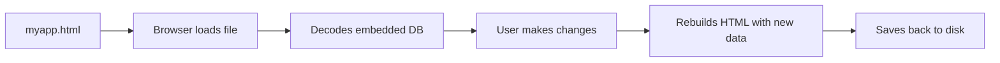

# MemoryFile

HTML files that remember everything.

Single HTML files with embedded SQLite databases that save themselves. No server needed. Just double-click to open, edit data, and save.

## Try It

```bash
# Open any of these locally - they work offline
open examples/01-basic-demo.html
open examples/04-trust-demo.html
open examples/05-encryption-demo.html
```

Each file contains a full SQLite database. Make changes, press Ctrl+S, and the file updates itself with your data.

## How It Works



The HTML file contains everything: UI, JavaScript, SQLite WASM library, and your database encoded as base64. When you save, JavaScript rebuilds the entire file with updated data.

## Features

- Full SQLite via WebAssembly
- AES-256-GCM encryption (enabled by default)
- Content-addressed filenames for tamper detection
- Visual trust badges showing verification status
- Works offline, no server required
- Portable - email, USB, or version control

## Quick API

```javascript
const mf = new MemoryFile({ encrypted: true });
const password = await getPassword(); // implement in your UI
if (!password) throw new Error('Password required');
await mf.loadEmbeddedDatabase(password);

mf.run('INSERT INTO tasks (name) VALUES (?)', ['My task']);
const results = mf.exec('SELECT * FROM tasks');

await mf.saveToFile('myapp.html', password);
```

## Browser Support

| Environment | JS execution | Save in place | Export | Notes |
|-------------|--------------|---------------|--------|-------|
| Desktop Chrome/Edge (http/https) | Yes | Yes | Yes | File System Access API |
| Desktop Firefox/Safari (http/https) | Yes | No | Yes | Downloads a new copy |
| iOS Safari/Chrome opened from Files/Downloads | No | No | No | Quick Look does not run JS |
| Android Chrome opened from Downloads | Yes | No | Limited | External files may not load from file:// |
| Mobile browsers (http/https) | Yes | No | Yes | Use export/share |

## Limits

Practical limits on typical hardware (16GB RAM, Chrome 2026):
- Rows: 100K-500K depending on size
- Database: 50-100 MB comfortable, 500 MB maximum
- Base64 adds 33% overhead

Run `tests/limits-runner.html` to discover your system's limits.

## Documentation

- [Quick Start](docs/QUICK_START.md)
- [Architecture](docs/ARCHITECTURE.md)
- [Security](SECURITY.md)
- [Trust System](docs/TRUST_ARCHITECTURE.md)
- [Testing](docs/TESTING.md)
- [Limits Research](docs/LIMITS.md)

## Testing

Run any example to verify functionality works. For contributors running the full test suite, see [CONTRIBUTING.md](CONTRIBUTING.md).

## License

MIT
